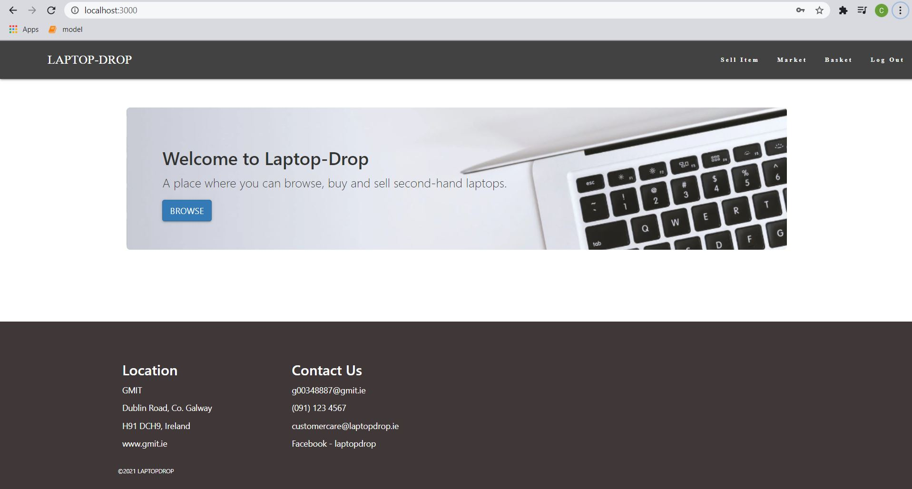
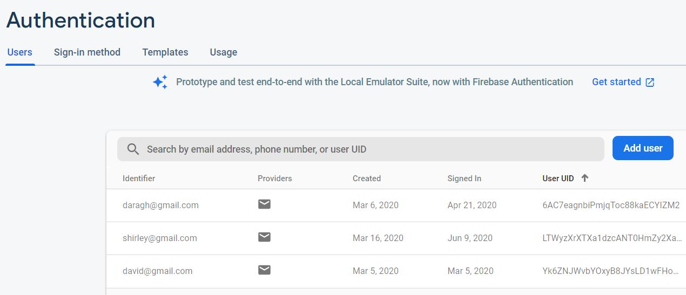
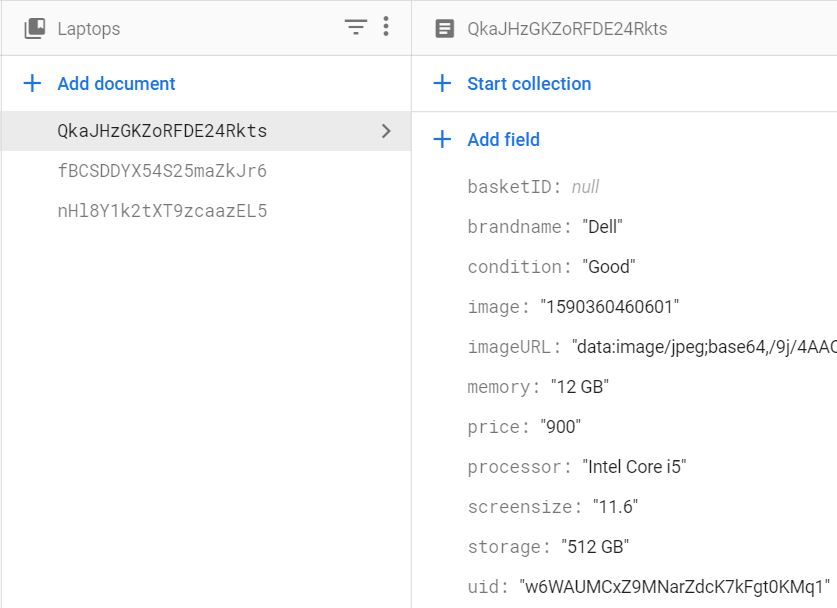

## An application for posting and purchasing laptops. 
### Written in React using Redux and Firebase. 
***
<br></br>
 <br></br>
(GUI designed using `react-bootstrap`)

### Features
* Secure OAuth 2.0 standard user authentication 
  * 
* Utilises cloud firestore + storage for the back-end database. (currently inactive)
  * 
* Examples of integrations such as `redux-thunk` and `react-redux-firebase`

### Installation
```
npm install --save LaptopDrop
```